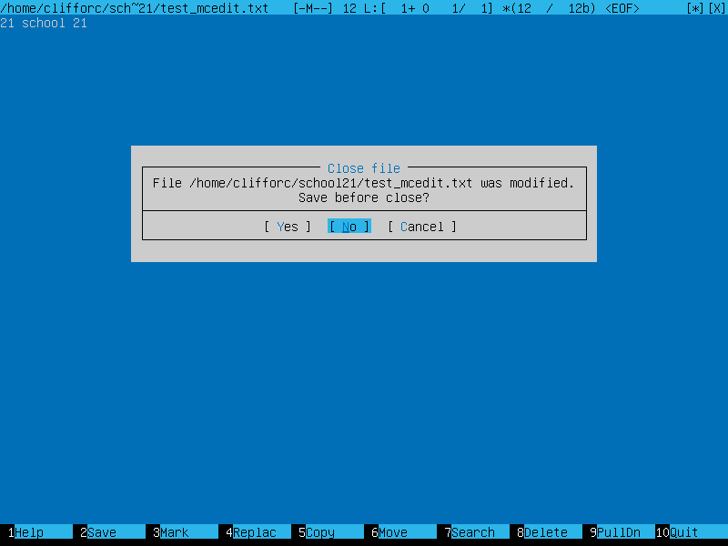
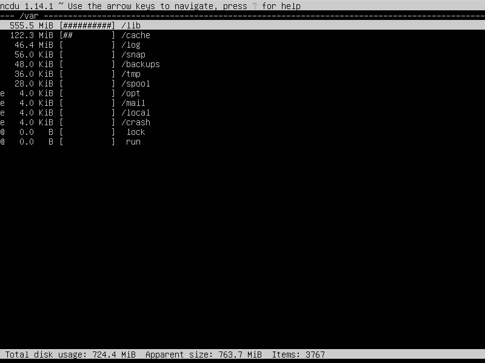

# Основы администрирования Linux

Проект охватывает фундаментальные задачи администрирования Linux, предоставляя практический опыт работы с Ubuntu Server 20.04 LTS.

Данный проект является частью образовательной программы [School21](https://21-school.ru/) (образовательный проект от Сбер для разработчиков)

# Содержание

[Part 1. Установка ОС](#part-1-установка-ос) 
[Part 2. Создание пользователя](#part-2-создание-пользователя) 
[Part 3. Настройка сети ОС](#part-3-настройка-сети-ос) 
[Part 4. Обновление ОС](#part-4-обновление-ос) 
[Part 5. Использование команды sudo](#part-5-использование-команды-sudo) 
[Part 6. Установка и настройка службы времени](#part-6-установка-и-настройка-службы-времени) 
[Part 7. Установка и использование текстовых редакторов](#part-7-установка-и-использование-текстовых-редакторов) 
[Part 8. Установка и базовая настройка сервиса SSHD](#part-8-установка-и-базовая-настройка-сервиса-sshd) 
[Part 9. Установка и использование утилит top, htop](#part-9-установка-и-использование-утилит-top-htop) 
[Part 10. Использование утилиты fdisk](#part-10-использование-утилиты-fdisk) 
[Part 11. Использование утилиты df](#part-11-использование-утилиты-df) 
[Part 12. Использование утилиты du](#part-12-использование-утилиты-du) 
[Part 13. Установка и использование утилиты ncdu](#part-13-установка-и-использование-утилиты-ncdu) 
[Part 14. Работа с системными журналами](#part-14-работа-с-системными-журналами) 
[Part 15. Использование планировщика заданий CRON](#part-15-использование-планировщика-заданий-cron) 

## Part 1. Установка ОС

#### На скриншоте показана версия установленной ОС при помощи комманды `cat /etc/issue`.

## Part 2. Создание пользователя

#### На скриншоте показан процесс создания нового пользователя в группе adm.

#### На скриншоте показан вывод комманды <cat /etc/passwd>.

## Part 3. Настройка сети ОС

#### На скриншоте показан процесс изменения названия машины на user-1.

#### На скриншоте показан процесс установки временной зоны.

#### На скриншоте показаны все сетевые интерфейсы.

Интерфейс loopback (lo) - это виртуальный сетевой интерфейс, который является 
частью стека TCP/IP в операционных системах Linux. Он используется для тестирования 
и межпроцессной связи внутри компьютера. Любые пакеты, отправленные на этот интерфейс,
сразу же возвращаются обратно к отправителю.

#### На скриншоте показан ip адрес устройства от DHCP сервера.

DHCP (Dynamic Host Configuration Protocol) — это протокол, который автоматически назначает IP-адреса и другие параметры сети устройствам в сети.

#### На скриншоте показаны внешний ip-адрес шлюза (ip) и внутренний IP-адрес шлюза, он же ip-адрес по умолчанию (gw).

- Задаем статичные настройки ip, gw, dns (sudo nano /etc/netplan/01-netcfg.yaml):

- Перезагружаем виртуалку (sudo reboot);
- Проверяем, что статичные сетевые настройки применились:

- Пингуем удаленные хосты 1.1.1.1 и ya.ru:

## Part 4. Обновление ОС

#### На скриншоте показано, что обновления отсутствуют.

## Part 5. Использование команды sudo

Команда <b>sudo</b> ( substitute user and do, подменить пользователя и выполнить ) позволяет строго определенным пользователям выполнять указанные программы с административными привилегиями без ввода пароля суперпользователя root. Если быть точнее, то команда sudo позволяет выполнять программы от имени любого пользователя, но, если идентификатор или имя этого пользователя не указаны, то предполагается выполнение от имени суперпользователя root. Таким образом, использование sudo позволяет выполнять привилегированные команды обычным пользователям без необходимости ввода пароля суперпользователя root .

#### Для разрешения пользователю выполнять комманду sudo необходимо:

- Выполнить команду <b>sudo visudo</b> для добавления пользователя в файл /etc/sudoers;
- Добавить строку: <b>\<username> ALL:(ALL) NOPASSWD:ALL</b>;
- Добавить пользователя в группу <b>sudo</b> при помощи комманды <b>sudo usermod -aG sudo \<username></b>

## Part 6. Установка и настройка службы времени

Для включения службы автоматической синхронизации времени нужно использовать команду <b>sudo timedatectl set-ntp on</b>

## Part 7. Установка и использование текстовых редакторов

#### NANO save and quit

- <b>ctrl + s</b> - save file
- <b>ctrl + x</b> - exit

#### VIM save and quit

- <b>:wq</b> - write and quit

#### MCEDIT save and quit

- <b>F2</b> - save
- <b>F10</b> - exit

#### NANO do not save and quit

- <b>ctrl + x</b> - exit
- <b>N</b> - do not save file

#### VIM do not save and quit

- <b>:q!</b> - quit without saving

#### MCEDIT do not save and quit

- <b>F10</b> - exit and select <b>NO</b>

#### NANO replace

- <b>alt + r</b> - для начала поиска и замены;
- вводим слово которое хотим заменить;
- <b>A</b> - чтобы заменить все совпадения;
- <b>N</b> - для итерации по словам;
- <b>Y</b> - для подтверждения замены слова;

#### VIM replace

- <b>/</b> - чтобы начать поиск слова для замены, после ввода слова жмем enter;
- <b>cgn</b> - комманда стирает первое найденное слово и переходит в режим ввода текста на его месте;
- <b>N</b> - переносит к следующему искомум слову;
- <b>.</b> - заменяет следующее слово.

#### MCEDIT replace

- <b>F4</b> - для открытия диалогового окна для поиска и замены слова.

## Part 8. Установка и базовая настройка сервиса SSHD

- <b>sudo apt-get install -y openssh-server</b> - Установка SSHd сервиса;
- <b>sudo systemctl enable ssh</b> - Включение автостарта службы при запуске системы;
- <b>sudo nano /etc/ssh/sshd_config</b> - В конфиге sshd находим строчку '#Port 22' и заменяем на 'Port 2022'
- <b>sudo systemctl restart ssh</b> - перезапускаем сервис;
- <b>ps aux | grep sshd</b> - для вывода процесса sshd:
  - <b>ps</b> - отображение текущих процессов;
  - <b>a</b> - флаг для отображения всех процессов;
  - <b>u</b> - включение в отчет информации о пользователе;
  - <b>x</b> - показывать процессы не занятые терминалом;
  - <b>grep sshd</b> - фильтр вывода в консоль только результатов содержащих 'sshd'.

#### Вывод команды netstat -tan

- <b>-t</b> - отображает текущее состояние разгрузки соединения;
- <b>-a</b> - отображает все соединения и прослушиваемые порты;
- <b>-n</b> - отображает адреса и номера портов в числовом виде.

- <b>Proto</b> - протокол;
- <b>Recv_Q</b> - количество байтов, не скопированных пользовательской программой, подключенной к этому сокету;
- <b>Send-Q</b> - количество байтов, не подтвержденных удаленным хостом;
- <b>Local Address</b> - IP-адрес локального компьютера и используемый порт;
- <b>Foreign Address</b> - P-адрес и номер порта удаленного компьютера;
- <b>State</b> - представляет состояние TCP-соединений.

## Part 9. Установка и использование утилит top, htop

#### Вывод команды top

- uptime: up 32 min$
- количество авторизованных пользователей: 1 user;
- общую загрузка системы: load average: 0.00, 0.00, 0.00;
- общее количество процессов: 94;
- загрузка cpu: 0.0us, 0.3sy, 0.0ni, 99.7id, 0.0wa, 0.0hi, 0.0si, 0.0st;
- загрузка памяти: MiB Mem 7946.2 total, 7512.7 free, 141.9 used, 291.6 buff/cache;
- pid процесса занимающего больше всего памяти: 1;
- pid процесса, занимающего больше всего процессорного времени 1;

#### Вывод команды htop

## Part 10. Использование утилиты fdisk

- Disk model: VBOX HARDDISK
- Размер: 10 GiB
- Кол-во секторов: 20971520;
- Размер swap: 1M/1.8G/8.3G

## Part 11. Использование утилиты df

#### Команда df

- размер раздела: 8408452
- размер занятого пространства: 2674088
- размер свободного пространства: 5285648
- процент использования: 34%
- единица измерения: kilobyte

#### Команда df -Th

- размер раздела: 8.1G
- размер занятого пространства: 5.1G
- размер свободного пространства: 2.6G
- процент использования: 34%
- тип файловой системы: ext4

## Part 12. Использование утилиты du

#### Вывод команды du для /home, /var, /var/log

- <b>-s</b> - суммирует и показывает общий размер дирректории
- <b>-b</b> - показывает размер в байтах
- <b>-h</b> - выводит размер в человекочитаемом формате

#### Вывод команды du для содержимого /var/log

## Part 13. Установка и использование утилиты ncdu

- <b>sudo apt-get install -y ncdu</b> - установка утилиты ncdu;
- <b>ncdu /home</b> - запуск утилиты для директории /home;

- <b>ncdu /var</b> - запуск утилиты для директории /var;

- <b>ncdu /var/log</b> - запуск утилиты для директории /var/log;

## Part 14. Работа с системными журналами

#### Время последней успешной авторизации

#### Скрин с сообщением о рестерте службы sshd

## Part 15. Использование планировщика заданий CRON

#### Лог с отчетом о работе chron

#### uptime.log

#### syslog

#### Список текущих задач chron

#### Пустой список задач chron

